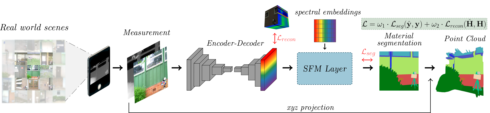

<p align="center">
  <h1 align="center">Beyond Appearances: Material Segmentation with Embedded Spectral Information from RGB-D imagery</h1>
  <p align="center">
    
  <p align="center">
    <a href="https://github.com/Factral/" rel="external nofollow noopener" target="_blank"><strong>Fabian Perez</strong></a>
    ·
    <a href="https://scholar.google.com/citations?user=seyRms4AAAAJ&hl=en&oi=ao" rel="external nofollow noopener" target="_blank"><strong>Hoover Rueda-Chacón</strong></a>

  </p>
<p align="center">
    <a href="https://openaccess.thecvf.com/content/CVPR2024W/LXCV/papers/Perez_Beyond_Appearances_Material_Segmentation_with_Embedded_Spectral_Information_from_RGB-D_CVPRW_2024_paper.pdf" rel="external nofollow noopener" target="_blank">CVPRW 2024 Paper</a>


## Overview

In the realm of computer vision, material segmentation of natural scenes represents a challenge, driven by the complex and diverse appearances of materials. Traditional approaches often rely on RGB images, which can be deceptive given the variability in appearances due to different lighting conditions. Other methods, that employ polarization or spectral imagery, offer a more reliable material differentiation but their cost and accessibility restrict their everyday usage.

In this work, **we propose a deep learning framework that bridges the gap between high-fidelity material segmentation and the practical constraints of data acquisition**. Our approach leverages a training strategy that employs a paired RGBD-spectral data to incorporate spectral information directly within the neural network. This encoding process is facilitated by a **Spectral Feature Mapper (SFM)** layer, a novel module that embeds unique spectral characteristics into the network, thus enabling the network to infer materials from standard RGB-D images.

Once trained, the model allows to conduct material segmentation on widely available devices without the need for direct spectral data input. In addition, we generate the 3D point cloud from the RGB-D image pair, to provide a richer spatial context for scene understanding. Through simulations using available datasets, and real experiments conducted with an *iPad Pro*, our method demonstrates superior performance in material segmentation compared to other methods


## Features

- **Spectral Feature Mapping (SFM):** A custom layer that embeds unique spectral characteristics directly within the neural network.
- **3D Point Cloud Generation:** Produces a richer spatial context for scene understanding using RGB-D images.
- **Efficient Material Segmentation:** Enables high-quality material segmentation on consumer-grade devices like the iPad Pro.

## Results

Our method demonstrates superior performance in material segmentation tasks, specifically in complex natural scenes, as evidenced by our experiments:

<div align="center">

| Input | Method | Accuracy | Average Class IoU |
|-------|--------|----------|-------------------|
| RGB   | U-Net  | 0.687    | 0.236             |
| RGB   | FCN    | 0.829    | 0.443             |
| RGB-D | **Ours**   | **0.8647**   | **0.4837**            |

</div>

## Repository Structure

The codebase is organized into several directories and files, each serving a specific function in the framework:

- `architecture/`: Contains neural network architectures used in the model.
  - `BiFPN.py`: Defines the Bi-directional Feature Pyramid Network.
  - `FPN.py`: Defines the Feature Pyramid Network for efficient multi-scale processing.
  - `unet.py`: UNet architecture modified with a Resnet50 encoder.
  - `core.py`: Core functionalities that are common across different models.

- `models/`: Reserved for storing trained model weights and architectures.

- `predictions/`: Stores output predictions from the model, useful for evaluation and visualization.

- `SFM/`: Spectral Feature Mapper module.
  - `core.py`: Core functionality for the SFM

- `static/`: Contains static resources such as images used in the README or documentation.

- `dataloader.py`: Handles data loading, preprocessing, and augmentations for training and evaluation.

- `evaluate.py`: Script for evaluating the model's performance on a test set.

- `inference.py`: Used for performing inference with the trained model on new data.

- `losses.py`: Custom loss functions specific to the model's training, such as SADPixelwise, Loss_MRAE, and Loss_RMSE.

- `metrics.py`: Defines metrics for evaluating model performance during testing.

- `prepare_dataset.py`: Script for preparing and preprocessing the dataset for training.

- `README.md`: Provides a detailed explanation of the project, installation instructions, and usage.

- `requirements.txt`: Lists all the Python dependencies necessary to run the project.

- `train.py`: The main script used to train the model.

- `utils.py`: Contains various utility functions supporting training, data manipulation, and other tasks.

Each directory and file is structured to maintain clarity and modularity, ensuring that different aspects of the project are easily accessible and modifiable.

The architecture implementations are based on the code from [PyTorch Toolbelt](https://github.com/BloodAxe/pytorch-toolbelt), which provides a collection of useful modules for PyTorch. We thank the contributors for sharing these valuable resources.

## Installation

To set up the environment for running the experiments, follow these steps:

```bash
git clone https://github.com/Factral/Spectral-material-segmentation.git
cd Spectral-material-segmentation
pip install -r requirements.txt
```

## Usage

### Preparing the Dataset

Before you start training the model, you need to download and prepare the dataset:

1. **Download the Dataset:**
   - Download the dataset from [CSIRO Data Access Portal](https://data.csiro.au/collection/csiro%3A55630v4).
   
2. **Extract the Dataset:**
   - Unzip the downloaded dataset into a desired directory.

3. **Prepare the Data:**
   - Run the `prepare_dataset.py` script for all splits (train, test, val) to process and set up the dataset.
   - Example command for each split:
     ```bash
     python prepare_dataset.py --dir /path/to/extracted/dataset --split train
     python prepare_dataset.py --dir /path/to/extracted/dataset --split test
     python prepare_dataset.py --dir /path/to/extracted/dataset --split val
     ```

### Training, Evaluating, and Inference

- **Set WandB API Key:**
  - Configure your Weights & Biases API key for logging and tracking experiments by replacing `YOUR-WANDB-KEY` in the script or environment.

- **Run Training:**
  - Start training the model using:
    ```bash
    python train.py --model FPN --batch_size 16 --epochs 100 --init_lr 3e-3 \
    --data_root /path/to/dataset --exp_name experiment_name --loss focal
    ```

- **Evaluate the Model:**
  - To evaluate the model, ensure the model and dataset paths are correctly set:
    ```bash
    python evaluate.py --path_dataset /path/to/saved/model.pth --weights /path/to/weights.pth
    ```

- **Perform Inference:**
  - For running inference on new data:
    ```bash
    python inference.py --folder_path /path/to/folder  --weights /path/to/weights.pth
    ```


## Citation

If you find our work useful in your research, please consider citing:

```bibtex
@InProceedings{Perez_2024_CVPR,
    author    = {Perez, Fabian and Rueda-Chac\'on, Hoover},
    title     = {Beyond Appearances: Material Segmentation with Embedded Spectral Information from RGB-D imagery},
    booktitle = {Proceedings of the IEEE/CVF Conference on Computer Vision and Pattern Recognition (CVPR) Workshops},
    month     = {June},
    year      = {2024},
    pages     = {293-301}
}
```
